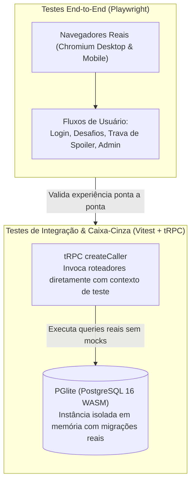

A suíte de testes do projeto foi projetada para resolver um desafio comum em aplicações relacionais: garantir fidelidade com o banco de dados sem depender de mocks frágeis ou contêineres Docker lentos.

---

## Duas Camadas Complementares



1. **Testes de Integração & Caixa-Cinza (`tests/integration/`)**:
   Validação de regras de negócio, autorização e persistência relacional. Executam contra uma instância isolada em memória do PostgreSQL real via `@electric-sql/pglite`.
2. **Testes End-to-End (`tests/e2e/`)**:
   Validação visual e comportamental no navegador real com **Playwright**, cobrindo fluxos críticos como login, submissões com proteção de spoiler e painel administrativo.

---

## Por que PGlite em vez de Mocks ou Docker?

Testar aplicações com PostgreSQL frequentemente leva a três armadilhas comuns:
- **Mocks de ORM**: Escondem quebras em migrations, joins, constraints de integridade referencial e comportamentos específicos do motor de banco.
- **SQLite em memória**: Incompatível com o dialeto do PostgreSQL (sem suporte nativo a schemas, enums PostgreSQL, campos de timestamps ou funções relacionais).
- **Testcontainers / Docker local**: Exige o daemon do Docker ativo e adiciona de 20 a 40 segundos de inicialização a cada execução da suíte, desencorajando o uso contínuo durante o desenvolvimento.

O **PGlite** compila o motor oficial do PostgreSQL 16 para WebAssembly (WASM). Isso permite instanciar um banco real diretamente no processo do Node.js em milissegundos, aplicando as migrações SQL reais geradas pelo Drizzle:

```typescript
// tests/helpers/test-db.ts
import { PGlite } from "@electric-sql/pglite";
import { drizzle } from "drizzle-orm/pglite";
import * as schema from "@orcestra-desafios/db/schema";

export async function createTestDatabase() {
  const client = new PGlite();
  
  // Aplica as migrações reais da pasta packages/db/src/migrations/
  await applyProjectMigrations(client);
  
  const db = drizzle({ client, schema });
  return { db, client };
}
```

Cada arquivo de teste recebe uma instância isolada, eliminando vazamentos de estado entre testes concorrentes sem necessidade de limpeza manual de tabelas.

---

## Testes de Procedimentos com `createCaller`

Para testar a camada de domínio da API sem a latência de tráfego HTTP de rede, instanciamos o `createCaller` fornecido pelo tRPC:

```typescript
// tests/integration/challenge.test.ts
import { appRouter } from "@orcestra-desafios/api";
import { createTestDatabase } from "../helpers/test-db";
import { createTestContext } from "../helpers/test-context";
import { memberPersona } from "../helpers/personas";

it("permite que um membro submeta uma solução válida", async () => {
  const { db } = await createTestDatabase();
  const ctx = createTestContext({ db, user: memberPersona });
  const caller = appRouter.createCaller(ctx);

  const submission = await caller.challenge.submit({
    challengeId: "desafio-semana-1",
    content: "function solucao() { return 42; }",
  });

  expect(submission.status).toBe("PENDING");
  expect(submission.userId).toBe(memberPersona.id);
});
```

Esse teste avalia simultaneamente:
1. Validação do schema Zod no payload.
2. Middlewares de autenticação e sessão.
3. Regra de negócio do roteador.
4. Instrução `INSERT` real do PostgreSQL executada pelo Drizzle ORM.

---

## Estrutura da Suíte no Repositório

```
tests/
├── integration/              # Testes de regras de negócio com PGlite
│   ├── auth.test.ts          # Sessões, tokens e controle de acesso
│   ├── challenge.test.ts     # Desafios, semanas e submissões
│   ├── ranking.test.ts       # Cálculo de pontuação e critérios de desempate
│   ├── admin.test.ts         # Aprovação/rejeição de submissões
│   └── user.test.ts          # Perfis de membros e seleção de trilhas
│
├── e2e/                      # Testes ponta a ponta no navegador
│   ├── auth.setup.ts         # Autenticação prévia e seed de cookies E2E
│   ├── auth.spec.ts          # Telas de login e cadastro
│   ├── challenge-flow.spec.ts# Fluxo de resolução e trava anti-spoiler
│   ├── ranking.spec.ts       # Visualização da tabela e filtros por trilha
│   └── admin.spec.ts         # Painel administrativo
│
└── helpers/                  # Fábricas e utilitários
    ├── test-db.ts            # Instanciação isolada de banco PGlite
    ├── test-context.ts       # Fábrica de contexto autenticado para tRPC
    ├── personas.ts           # Usuários de teste pré-definidos (Membro, Admin)
    └── factories.ts          # Geradores de desafios e submissões
```

---

## Comandos da Suíte de Testes

```bash
# Executa todos os testes de integração (executa em ~4 segundos)
npm run test

# Executa testes de integração em modo interativo (watch) durante o desenvolvimento
npm run test:watch

# Gera relatório consolidado de cobertura de código
npm run test:coverage

# Executa os testes End-to-End com Playwright (requer apps rodando)
npm run test:e2e

# Executa a validação completa (Integração + E2E)
npm run test:all
```
