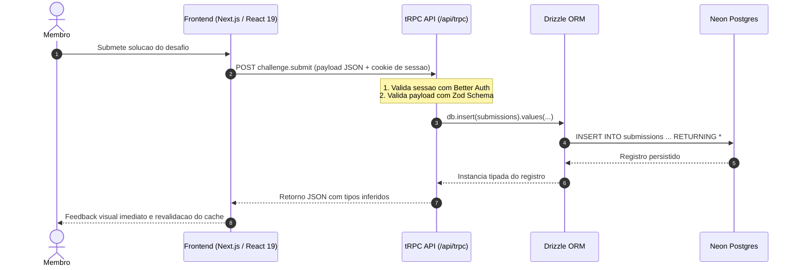

A comunicação entre interface e persistência é 100% tipada sem geração intermediária de código (sem rotinas de `codegen` ou arquivos `.graphql`). O compilador TypeScript verifica a compatibilidade de contratos entre backend e frontend a cada compilação.

---

## Ciclo de Vida de uma Operação

O diagrama abaixo ilustra o percurso completo de uma requisição típica, como a submissão de uma solução de código para validação:



---

## Camadas da Arquitetura

### 1. Resolução do Contexto de Requisição (`packages/api/src/context.ts`)

Para cada requisição direcionada a `/api/trpc`, o handler Next.js invoca a fábrica `createTRPCContext(opts)`:
1. Lê o cabeçalho `Cookie` enviado pelo navegador.
2. Inspeciona a sessão ativa utilizando o cliente do **Better Auth**.
3. Retorna o objeto de contexto injetado com a instância ativa do banco de dados (`db`), a sessão (`session`) e o usuário (`user`):

```typescript
export async function createTRPCContext(opts: { headers: Headers }) {
  const session = await auth.api.getSession({ headers: opts.headers });
  return {
    db,
    session,
    user: session?.user ?? null,
  };
}
```

### 2. Controle de Acesso por Middlewares (`packages/api/src/trpc.ts`)

Procedimentos do tRPC são encadeados através de middlewares reutilizáveis que enriquecem o contexto e garantem autorização em tempo de execução:

```typescript
// Procedimento restrito a usuarios autenticados
export const protectedProcedure = t.procedure.use(({ ctx, next }) => {
  if (!ctx.session || !ctx.user) {
    throw new TRPCError({ code: "UNAUTHORIZED", message: "Sessão inválida ou expirada." });
  }
  return next({
    ctx: {
      ...ctx,
      session: ctx.session,
      user: ctx.user,
    },
  });
});

// Procedimento restrito a administradores
export const adminProcedure = protectedProcedure.use(({ ctx, next }) => {
  if (ctx.user.role !== "ADMIN") {
    throw new TRPCError({ code: "FORBIDDEN", message: "Acesso restrito à diretoria técnica." });
  }
  return next({ ctx });
});
```

### 3. Procedimento de Domínio com Validação Zod (`packages/api/src/routers/challenge.ts`)

O procedimento valida rigorosamente a entrada e executa operações no banco via Drizzle ORM:

```typescript
export const challengeRouter = createTRPCRouter({
  submit: protectedProcedure
    .input(
      z.object({
        challengeId: z.string().uuid(),
        content: z.string().min(1, "A solução não pode estar vazia.").max(10000),
      })
    )
    .mutation(async ({ ctx, input }) => {
      const [submission] = await ctx.db
        .insert(submissions)
        .values({
          challengeId: input.challengeId,
          userId: ctx.user.id,
          content: input.content,
          status: "PENDING",
        })
        .returning();

      return submission;
    }),
});
```

### 4. Consumo no Cliente com TanStack Query v5 (`apps/web`)

No frontend, os componentes utilizam os hooks do cliente tRPC (`utils/trpc.ts`). Os tipos dos argumentos de entrada e o objeto retornado são inferidos diretamente do `AppRouter` exportado pelo backend:

```tsx
"use client";

import { trpc } from "@/utils/trpc";
import { toast } from "sonner";

export function SubmitSolutionForm({ challengeId }: { challengeId: string }) {
  const utils = trpc.useUtils();

  const submitMutation = trpc.challenge.submit.useMutation({
    onSuccess: () => {
      toast.success("Solução enviada com sucesso para moderação!");
      // Invalida e revalida automaticamente a lista e o ranking
      utils.challenge.getById.invalidate({ id: challengeId });
      utils.ranking.getGlobal.invalidate();
    },
    onError: (err) => {
      toast.error(err.message);
    },
  });

  // submitMutation.mutate({ challengeId, content }) tem tipagem estrita
}
```

Qualquer alteração feita no backend (como mudar o nome de um campo ou o tipo de uma propriedade) gera imediatamente um erro de compilação TypeScript no frontend no momento em que você salva o arquivo no editor.
