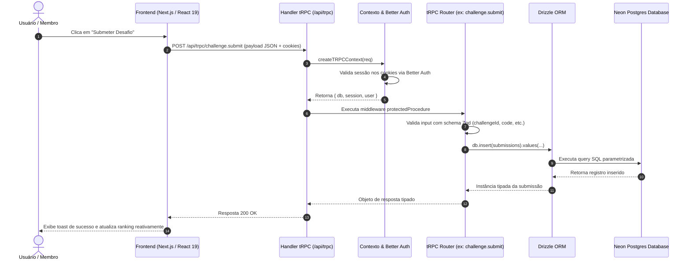

Um dos princípios fundamentais da arquitetura do **Orc'estra Desafios** é a garantia de integridade tipada ponta a ponta sem qualquer necessidade de ferramentas de geração de código intermediárias (como codegen do GraphQL ou schemas OpenAPI manuais).

---

## 1. Ciclo de Vida de uma Operação



---

## 2. Camadas da Arquitetura de Dados

### 1. Modelagem Relacional no Drizzle (`packages/db`)
As tabelas são declaradas com TypeScript nativo:

```typescript
export const submissions = pgTable("submissions", {
  id: text("id").primaryKey(),
  challengeId: text("challenge_id").notNull().references(() => challenges.id),
  userId: text("user_id").notNull().references(() => users.id),
  content: text("content").notNull(),
  status: text("status", { enum: ["PENDING", "APPROVED", "REJECTED"] }).default("PENDING"),
  createdAt: timestamp("created_at").defaultNow(),
});
```

### 2. Contexto de Autenticação (`packages/api/src/context.ts`)
Para cada requisição HTTP recebida, o contexto é resolvido:
- Lê o cabeçalho de cookies.
- Recupera a sessão ativa do usuário através do Better Auth.
- Injeta a instância do banco Drizzle (`ctx.db`) e a sessão autenticada (`ctx.session`).

### 3. Procedimentos Protegidos (`packages/api/src/trpc.ts`)
O tRPC possui middlewares que garantem a segurança em tempo de compilação e execução:

```typescript
export const protectedProcedure = t.procedure.use(({ ctx, next }) => {
  if (!ctx.session || !ctx.session.user) {
    throw new TRPCError({ code: "UNAUTHORIZED" });
  }
  return next({
    ctx: {
      ...ctx,
      session: ctx.session,
      user: ctx.session.user,
    },
  });
});

export const adminProcedure = protectedProcedure.use(({ ctx, next }) => {
  if (ctx.user.role !== "ADMIN") {
    throw new TRPCError({ code: "FORBIDDEN" });
  }
  return next({ ctx });
});
```

### 4. Consumo no Frontend via React Query (`apps/web`)
No cliente React, o hook gerado pelo tRPC infere automaticamente o tipo exato dos dados de retorno e dos parâmetros de entrada:

```tsx
const { data, isLoading } = trpc.challenge.getById.useQuery({ id: challengeId });
// 'data' já possui os tipos TypeScript exatos do schema Drizzle
```
Se uma coluna for adicionada ou renomeada no schema do banco de dados, o TypeScript emite um erro de compilação imediato no componente da interface antes mesmo do código ser enviado para produção.
