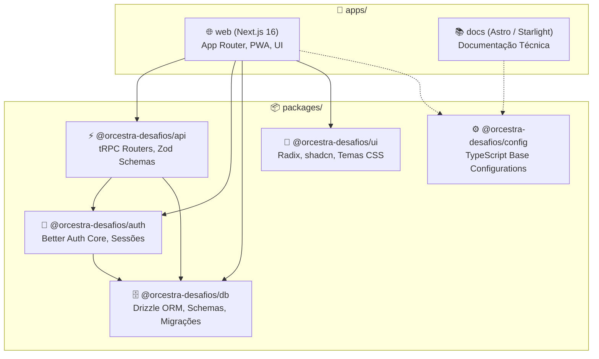

A plataforma **Orc'estra Desafios** é estruturada como um **monorepo npm workspaces**, permitindo o isolamento modular de domínio com compartilhamento nativo de tipos TypeScript e utilitários.

---

## 1. Topologia de Aplicações & Pacotes

---

## 2. Detalhamento dos Componentes

### 📁 Aplicações (`apps/`)

#### `apps/web`
- **Tecnologias**: Next.js 16 (Turbopack, App Router), React 19, TanStack Query v5, Tailwind CSS v4.
- **Responsabilidades**:
  - Renderização das páginas da plataforma (Home, Desafios, Ranking, Perfil, Administração).
  - PWA offline-first com service worker dedicado e suporte a instalação em dispositivos móveis.
  - Camada de autenticação visual (telas de login e registro via Better Auth).
  - Consumo tipado da API via `@trpc/react-query`.

#### `apps/docs`
- **Tecnologias**: Astro, Starlight, Markdown/MDX.
- **Responsabilidades**:
  - Portal de documentação técnica interna e externa.
  - Histórico de decisões arquiteturais (ADRs).
  - Guias de onboarding e especificações de design system.

---

### 📦 Pacotes Compartilhados (`packages/`)

#### `packages/api`
- Define a instância do **tRPC v11** (`packages/api/src/trpc.ts`).
- Contém os roteadores de domínio:
  - `auth`: Autenticação e informações de sessão do usuário ativo.
  - `user`: Perfil do membro, trilha associada, alteração de dados e listagens.
  - `challenge`: Listagem de desafios por trilha/semana, visualização com proteção contra spoiler, submissão de respostas e histórico.
  - `ranking`: Algoritmo de classificação geral e por trilha com cálculo de pontuação acumulada.
  - `admin`: Gerenciamento de usuários, aprovação/rejeição de submissões, criação de desafios e auditoria.
  - `cloudinary`: Geração de assinaturas seguras para uploads diretos de mídia.
- Exporta o tipo `AppRouter`, base da segurança ponta a ponta.

#### `packages/auth`
- Configuração do **Better Auth** com o adapter relacional do Drizzle ORM.
- Suporte a cookies seguros HTTP-only, proteção CSRF e gerenciamento de sessões no banco de dados.

#### `packages/db`
- Definição tipada de todas as tabelas e relacionamentos via **Drizzle ORM**.
- Exporta os schemas relacionais (`users`, `sessions`, `accounts`, `verifications`, `challenges`, `submissions`).
- Contém scripts de migração (`drizzle-kit generate`, `migrate`, `push`).

#### `packages/ui`
- Biblioteca de componentes acessíveis inspirada no shadcn/ui e Radix Primitives.
- Tokens de design temáticos e esquemas de cores:
  - **Orc'estra Dark**: Tema oficial focado em ergonomia visual e contraste refinado.
  - **Orc'estra Light**: Variante limpa com tons suaves de verde e linho.
  - **Fauvismo**: Inspirado na vanguarda artística de Henri Matisse (tons terrosos, vermilion ardente, azuis noturnos).
  - **Pop Art**: Inspirado na serigrafia de Andy Warhol (magenta Marilyn, ciano elétrico e amarelo solar).

#### `packages/config`
- Configurações base de compilação TypeScript compartilhadas entre todos os módulos (`tsconfig.base.json`), prevenindo divergências de tipagem no ecossistema.
