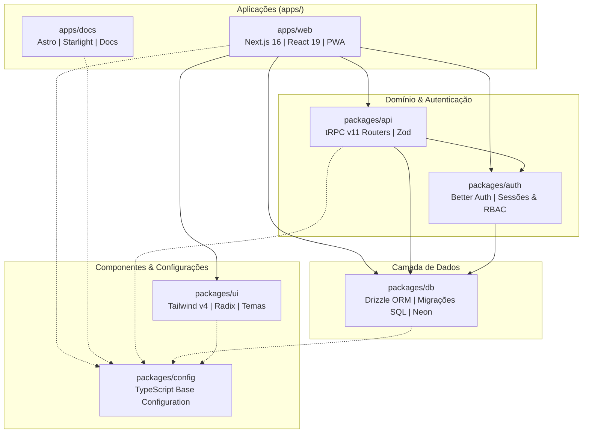

O projeto é estruturado como um monorepo gerenciado por **npm workspaces**. Cada módulo possui fronteiras bem delimitadas de domínio, compartilhando definições de tipos TypeScript sem duplicação de contratos ou etapas manuais de build.

---

## Árvore de Dependências entre Módulos

---

## Responsabilidades dos Workspaces

### Aplicações (`apps/`)

#### `apps/web`
- **Stack**: Next.js 16 (Turbopack, App Router), React 19 Compiler, TanStack Query v5, Tailwind CSS v4.
- **Papel no Sistema**:
  - Servir as interfaces interativas da plataforma (lista de desafios por semana/trilha, submissões com proteção contra spoiler, ranking dinâmico de pontuação e painel administrativo).
  - Progressive Web App (PWA) instalável em dispositivos móveis com cache de recursos estáticos via service worker.
  - Implementar o Route Handler do tRPC sob `/api/trpc` para despachar chamadas de backend a partir do mesmo domínio.
  - Alternância instantânea entre quatro temas gráficos (Orc'estra Dark, Orc'estra Light, Fauvismo e Pop Art).

#### `apps/docs`
- **Stack**: Astro 7, Starlight, astro-mermaid, Pagefind.
- **Papel no Sistema**:
  - Hub de documentação técnica, onboarding de novos membros, padrões de engenharia e histórico de decisões de arquitetura (ADRs).
  - Tema sincronizado com a identidade visual da plataforma, incluindo seletor de paletas e suporte a diagramas técnicos.

---

### Pacotes Compartilhados (`packages/`)

#### `packages/api`
- Define a instância raiz do **tRPC v11** (`packages/api/src/trpc.ts`).
- Contém a lógica de negócio organizada em procedimentos tipados com esquemas de entrada Zod:
  - `auth`: Dados da sessão atual e perfil do usuário logado.
  - `user`: Consulta e atualização de perfil do membro, trilha escolhida e listagens gerais.
  - `challenge`: Consulta de desafios filtrados por trilha/semana, visualização controlada com trava anti-spoiler e registro de submissões.
  - `ranking`: Agregação de pontos acumulados com critérios automatizados de desempate por horário de envio.
  - `admin`: Gerenciamento de permissões, moderação de submissões pendentes e criação de desafios semanais.
  - `cloudinary`: Assinatura segura de tokens para upload direto de mídias de demonstração.
- Exporta o tipo `AppRouter`, base para inferência direta nos componentes do frontend.

#### `packages/auth`
- Configuração do **Better Auth** integrado ao Drizzle ORM.
- Persistência e auditoria de sessões em banco de dados (`users`, `sessions`, `accounts`, `verifications`).
- Segurança via cookies HTTP-only com flags `SameSite` e proteção CSRF nativa.
- Controle de acesso baseado em papéis (`USER` e `ADMIN`).

#### `packages/db`
- Esquema relacional declarado em TypeScript via **Drizzle ORM** (`packages/db/src/schema/`).
- Gestão de migrações SQL puras versionadas em `packages/db/src/migrations/`.
- Conexão configurável:
  - Neon Serverless Postgres (via pooling HTTP / WebSocket em produção).
  - `@electric-sql/pglite` (instâncias efêmeras isoladas em memória para a suíte de testes de integração).

#### `packages/ui`
- Biblioteca de componentes acessíveis baseada nas primitivas do Radix UI e diretrizes do shadcn/ui.
- Folha de estilos unificada (`packages/ui/src/styles/globals.css`) com suporte ao Tailwind CSS v4 via `@import "tailwindcss";`.
- Tokens de cor, sombras táteis rígidas (`box-shadow: 4px 4px 0px ...`) e classes de apoio para as 5 trilhas técnicas do projeto.

#### `packages/config`
- Configuração TypeScript canônica (`tsconfig.base.json`) estendida por todos os workspaces, garantindo compilação uniforme com `strict: true` e `noUncheckedIndexedAccess: true`.
